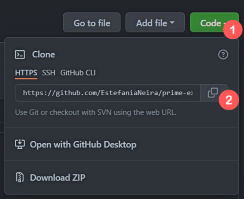
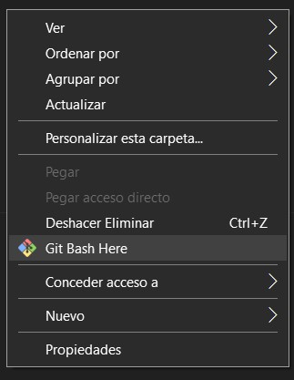

# **Instrucciones**
## Desafio Emonk
### Sigue estas instrucciones para ejecutar el proyecto desde la terminal de manera local.

1. Ingresa al [link](https://github.com/EstefaniaNeira/desafio-emonk.git)  del repositorio.

2. Clonaremos el proyecto que se encuentra en el repositorio, para ello debes dirigirte a **Code** y luego seleccionar el ítem señalado a continuación y de esta forma tendrás copiado el link del repositorio.                            

3. Una vez copiado el [link](https://github.com/EstefaniaNeira/desafio-emonk.git) debes crear una carpeta de forma local con el nombre del proyecto o uno relacionado a este.

4. Dentro de la carpeta creada debes abrir la terminal de git bash.          

5. Una vez abierta la terminal de git bash deberás ingresar el siguiente comando para clonar el proyecto en la carpeta local.  
`$ git clone https://github.com/EstefaniaNeira/desafio-emonk.git `

6. Finalmente ya clonado el proyecto ingresa el siguiente comando desde la terminal para hacer correr el proyecto creado.  
`$ npm start` 
